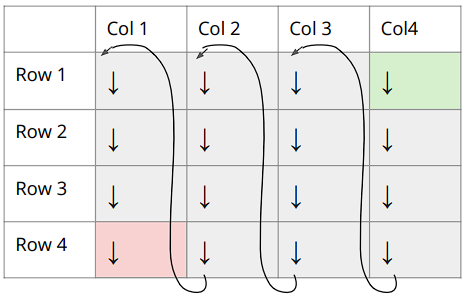
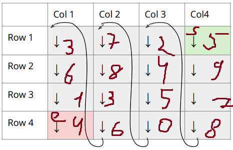

# ex_3

[
  [3, 7, 2, 5],
  [6, 8, 4, 9],
  [1, 3, 5, 7],
  [4, 6, 0, 8]
]

| - | c | c | c | c |
|---|---|---|---|---|  
| r | 3 | 7 | 2 | 5 |
| r | 6 | 8 | 4 | 9 |
| r | 1 | 3 | 5 | 7 |
| r | 4 | 6 | 0 | 8 |

output: 
5 -> 9 -> 7 -> 8 ->
2 -> 4 -> 5 -> 0 ->
7 -> 8 -> 3 -> 6 ->
3 -> 6 -> 1 -> 4.