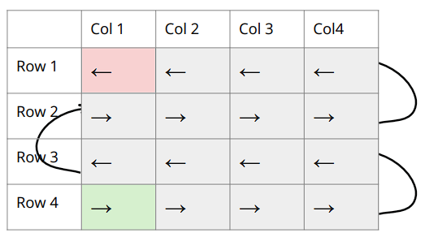
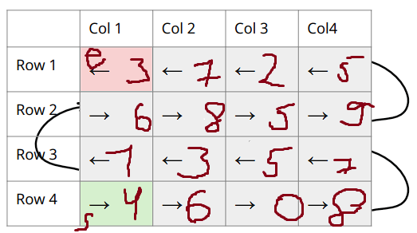

# ex_4

[
  [3, 7, 2, 5],
  [6, 8, 4, 9],
  [1, 3, 5, 7],
  [4, 6, 0, 8]
]

| 3 | 7 | 2 | 5 |
| 6 | 8 | 4 | 9 |
| 1 | 3 | 5 | 7 |
| 4 | 6 | 0 | 8 |

output: 
4 -> 6 -> 0 -> 8 ->
7 -> 5 -> 3 -> 1 ->
6 -> 8 -> 5 -> 9 ->
5 -> 2 -> 7 -> 3.

[ 
	[10, 3, 8, 2, 5, 7, 6, 9, 1, 4],
	[50, 20, 90, 70, 40, 60, 30, 10, 80, 100],
	[-3, -7, -1, -9, -2, -10, -4, -6, -8, -5],
	[5, 9, 2, 3, 10, 7, 6, 1, 4, 8],
	[500, 100, 900, 300, 700, 800, 400, 600, 200, 1000],
	[-10, 20, -40, 30, -50, 10, 0, -20, 40, -30],
	[9, 2, 5, 8, 1, 6, 4, 10, 7, 3],
	[13, 2, 5, 8, 21, 34, 1, 1, 3, 0],
	[5, 9, 2, 3, 10, 7, 6, 1, 4, 8],
	[30, 10, 90, 70, 80, 20, 50, 60, 40, 100]
]

output: 